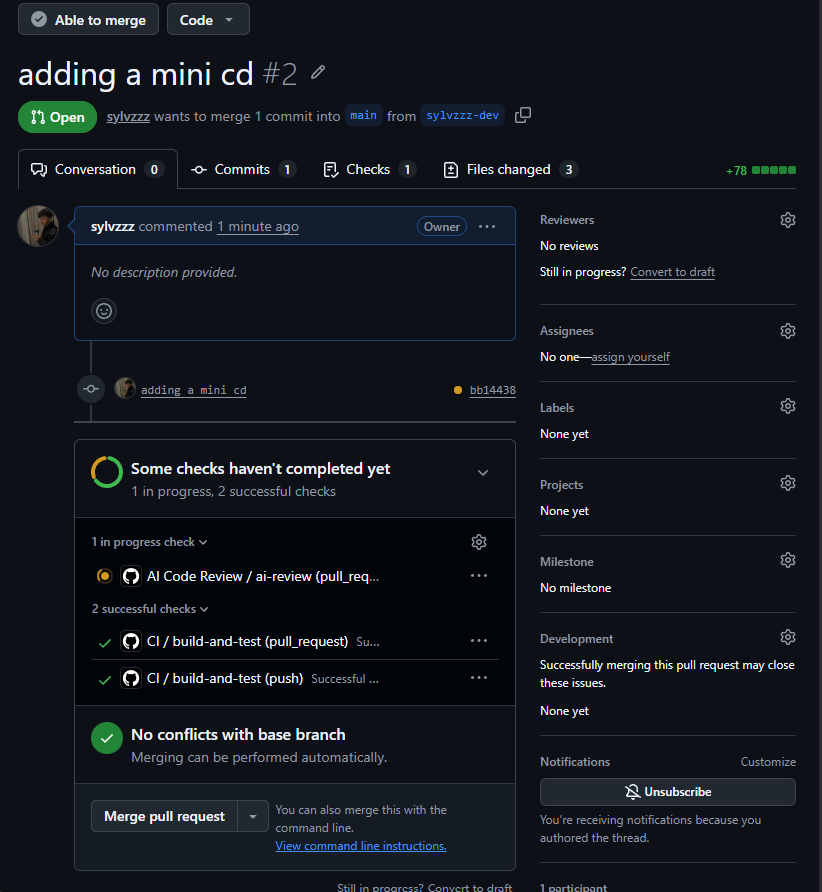

# AI-pipeline

An AI-based CI/CD pipeline that runs lint, build, and tests, reviews every pull request with an AI model, and ships a Docker image to GitHub Container Registry on push to main. Used for a NestJS REST API.

After a push, the open pull request gets AI review comments and the CD workflow runs. The screenshot below shows both.

## CI Demonstration on a Pull Request



## AI review comments on a pull request


## Endpoints

- `GET /` simply returns `Hello everyone!`
- `GET /health` returns `{ "status": "ok" }`

## Local dev

```sh
npm install
npm run start:dev
```

## Test / build

```sh
npm run lint
npm run test
npm run build
```

## Docker

```sh
docker build -t ai-pipeline .
docker run -p 3000:3000 ai-pipeline
```

## Workflows

- **CI:** lint, build, and test on PRs and pushes.
- **AI Code Review:** runs on every PR, posts a review using the NVIDIA API (`NVIDIA_API_KEY` secret).
- **CD:** on push to `main`, builds and pushes the image to `ghcr.io/<repo>:latest`.

## Secrets

- `NVIDIA_API_KEY` required by the AI review workflow.